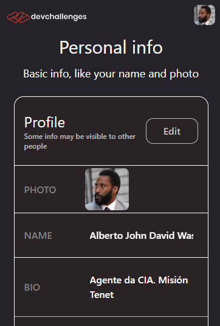
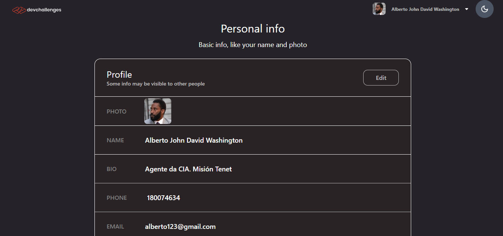

# Front-end Authentication System


Este repositorio contiene el frontend para un sistema de autenticación. La aplicación permite a los usuarios registrarse, iniciar sesión, y gestionar su perfil. Está construido con React y utiliza Tailwind CSS para los estilos. Design fue extraído de **[Figma](https://www.figma.com/design/ZM0DPZbzK39o3rqwiaOPTD/Authentication-App?node-id=0-1&node-type=CANVAS&t=0BCcbhAvC6zVs1al-0)**

## Tabla de Contenidos

- [Instalación](#instalación)
- [Uso](#uso)
- [Componentes](#componentes)
- [Contexto de Tema](#contexto-de-tema)
- [Estructura del Proyecto](#estructura-del-proyecto)
- [Contribuciones](#contribuciones)
- [Licencia](#licencia)

## Instalación

1. Clona el repositorio:

```bash
git clone https://github.com/devHyrum/Front-end-Authentication-System.git
```
2. Navega al directorio del proyecto:
```bash
cd Front-end-Authentication-System
```
3. Instala las dependencias:
```bash
npm install
```
## Uso
Para iniciar el servidor de desarrollo, ejecuta:
```bash
npm start
```
La aplicación se ejecutará en http://localhost:5173/.

## Componentes
### Login
El componente Login permite a los usuarios iniciar sesión con su nombre de usuario y contraseña. También incluye la funcionalidad para cambiar entre el modo oscuro y el modo claro.

### Register
El componente Register permite a los usuarios registrarse en la aplicación proporcionando su nombre de usuario, contraseña y correo electrónico.

### Profile
El componente Profile muestra la información del usuario y permite actualizar el perfil, incluyendo la imagen de perfil.

## Estructura del Proyecto
```plaintext
├── src
│   ├── assets
│   │   └── ... (imágenes y otros recursos)
│   ├── components
│   │   ├── EditUser.jsx
│   │   ├── GroupChat.jsx
│   │   ├── Header.jsx
│   │   ├── Login.jsx
│   │   ├── Register.jsx
│   │   └── Profile.jsx
│   ├── context
│   │   └── ThemeContext.jsx
│   ├── App.jsx
│   ├── index.css
│   └──  main.jsx
├── tailwind.config.js
├── package.json
└── README.md
```
##  Contribuciones
Las contribuciones son bienvenidas. Para contribuir, por favor sigue estos pasos:

1. Haz un fork del repositorio.
2. Crea una nueva rama (git checkout -b feature-nueva-funcionalidad).
3. Realiza tus cambios.
4. Haz un commit de tus cambios (git commit -am 'Añadir nueva funcionalidad').
5. Sube tus cambios (git push origin feature-nueva-funcionalidad).
6. Abre un Pull Request.